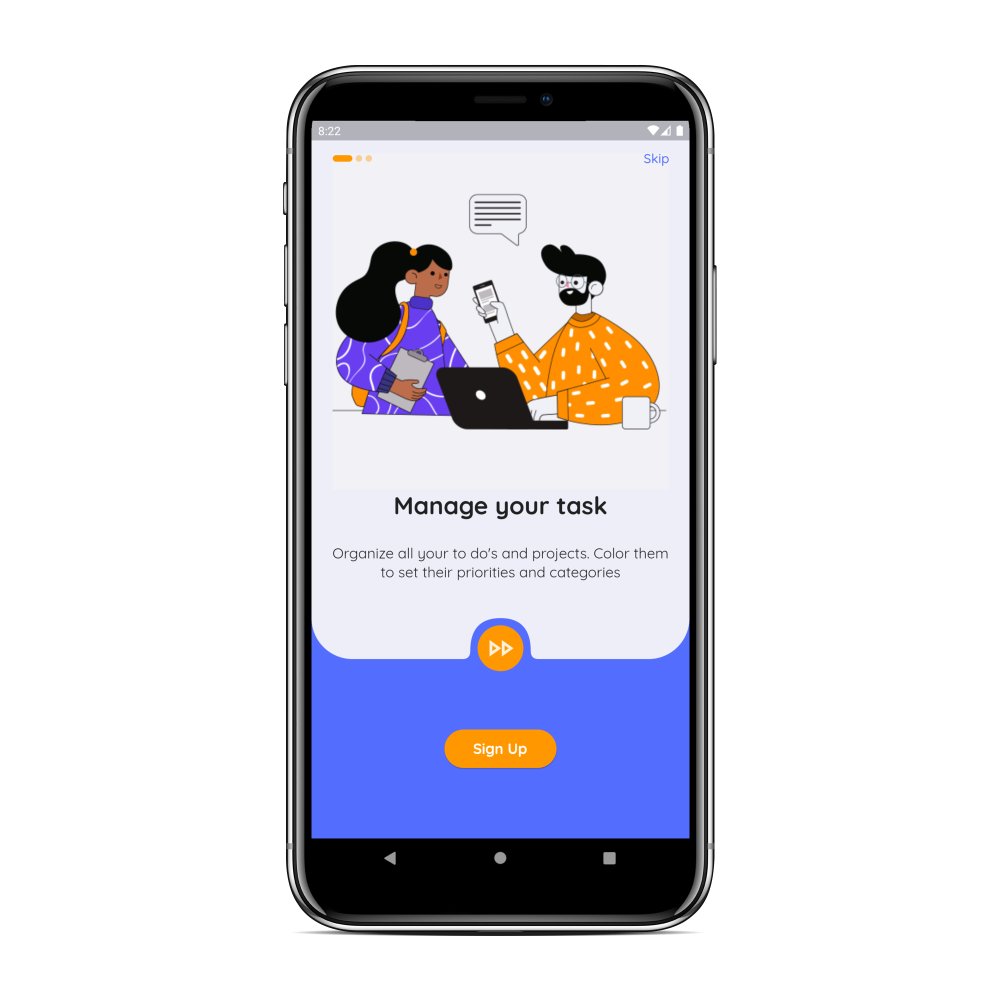
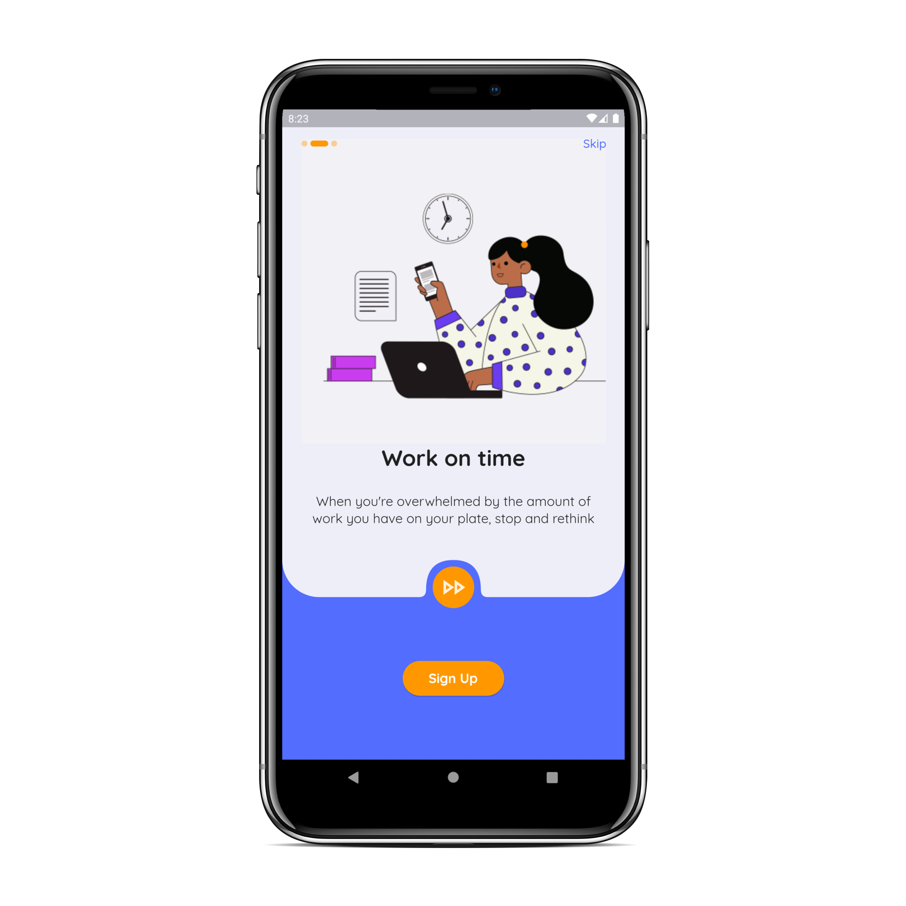
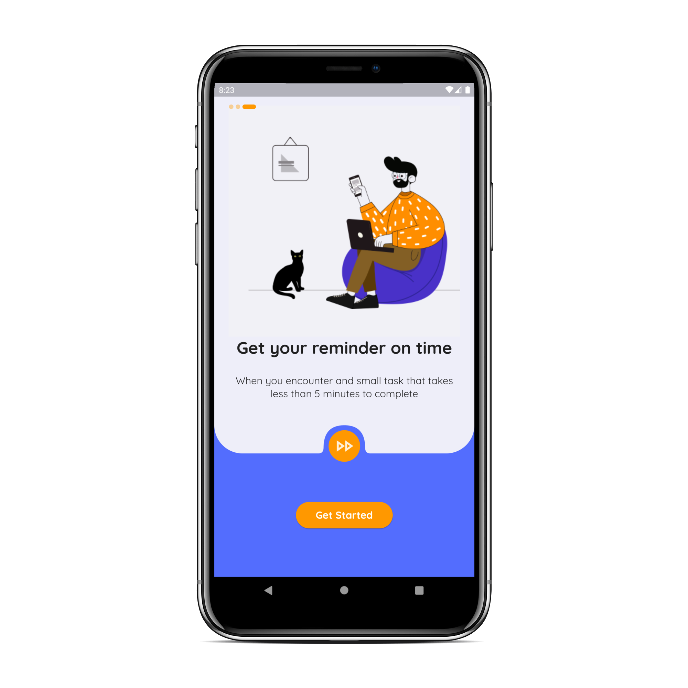

# Onboarding UI  

A mobile app onboarding concept cloned with Flutter.  
[Original Design on Uplabs](https://www.uplabs.com/posts/nature-landing-page-design) by [CMARIX TechnoLabs](https://www.uplabs.com/cmarixtechnolabs)  

## Screenshots

| Screen 1 | Screen 2 | Screen 3 |
| --- | --- | --- |
|  |  |  |

Made with :heart_eyes: by [Akora-IngDKB](https://github.com/Akora-IngDKB).  
Follow me on [Twitter](https://twitter.com/Akora_IngDKB) and [Instagram](https://www.instagram.com/akora_ingdkb/)   
Please show some :heart: by giving this repo as :star: as I will be updating it with time.  
