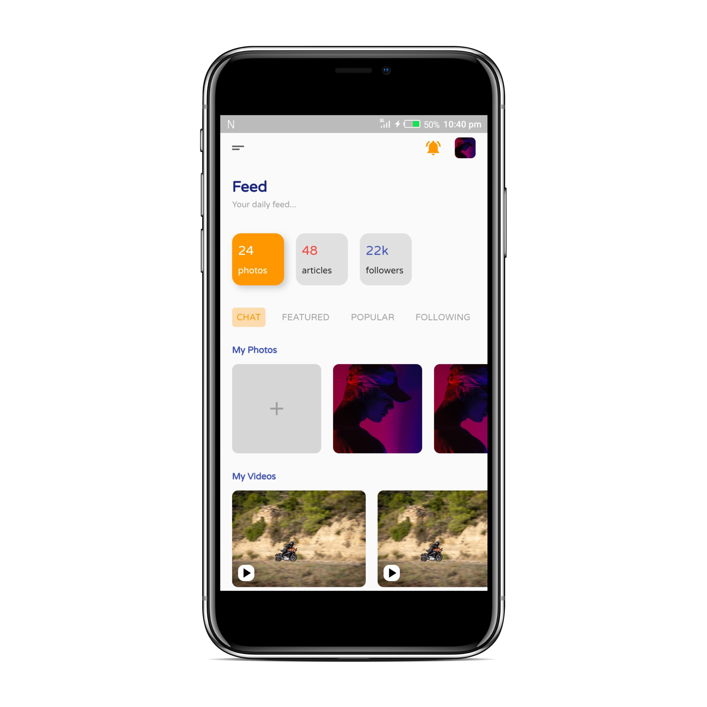
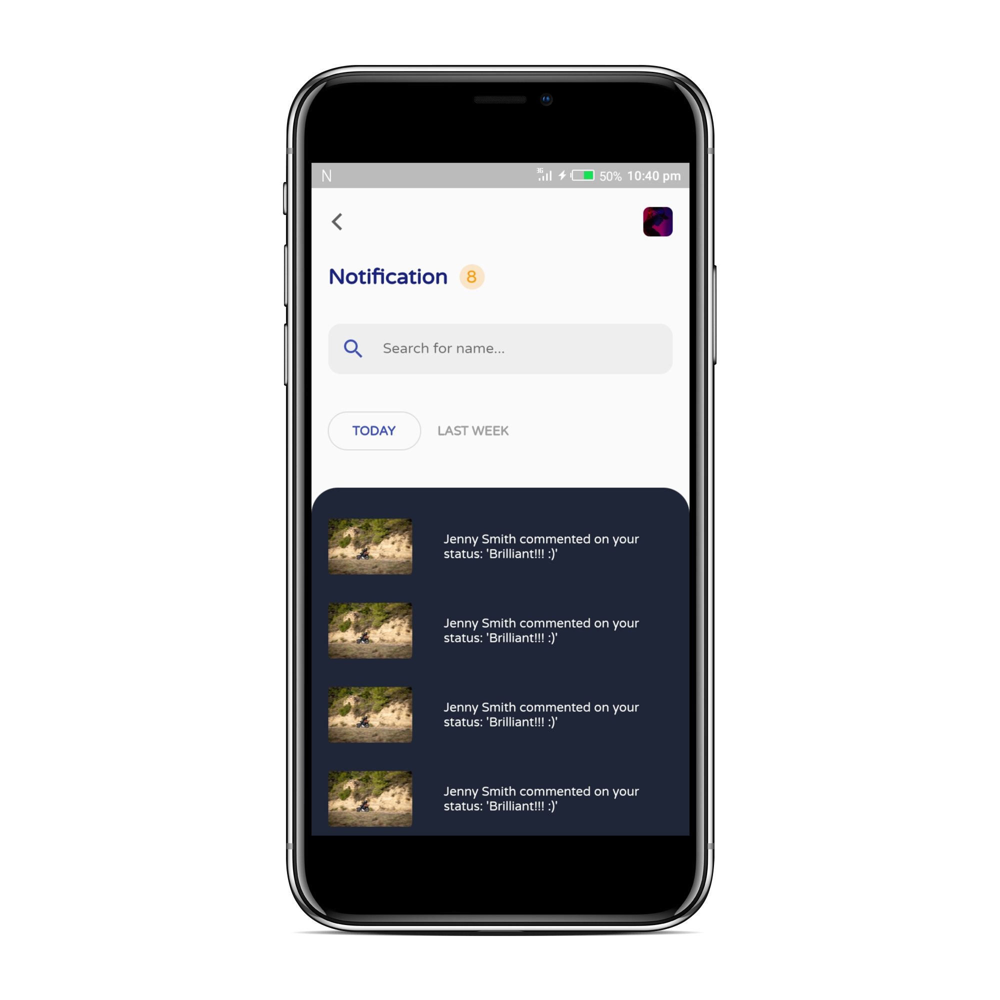
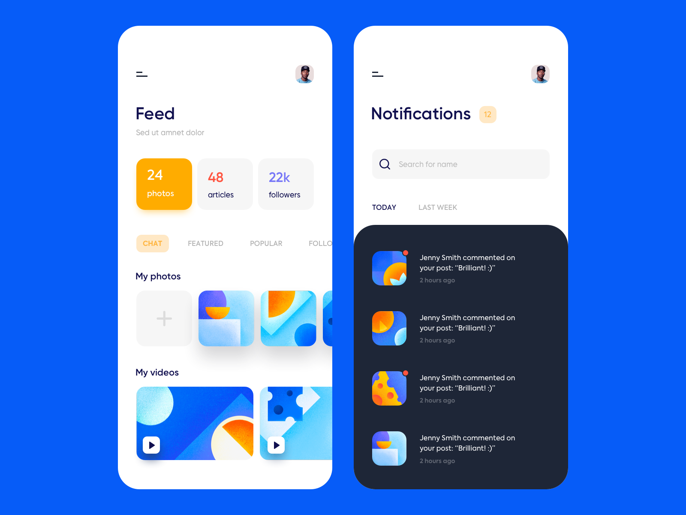

# Social App UI  

A simple Social UI concept cloned with Flutter.   
 
## Screenshots

| Feed | Notifications |
| :---: | :---: |
|  |  |

### Original Design
Original Design on Dribbble by [Outcrowd](https://dribbble.com/outcrowd).  

 

Made with :heart_eyes: by [Akora-IngDKB](https://github.com/Akora-IngDKB).  
Follow me on [Twitter](https://twitter.com/Akora_IngDKB) and [Instagram](https://www.instagram.com/akora_ingdkb/).     
Please show some :heart: by giving this repo as :star: as I will be updating it with time.  
