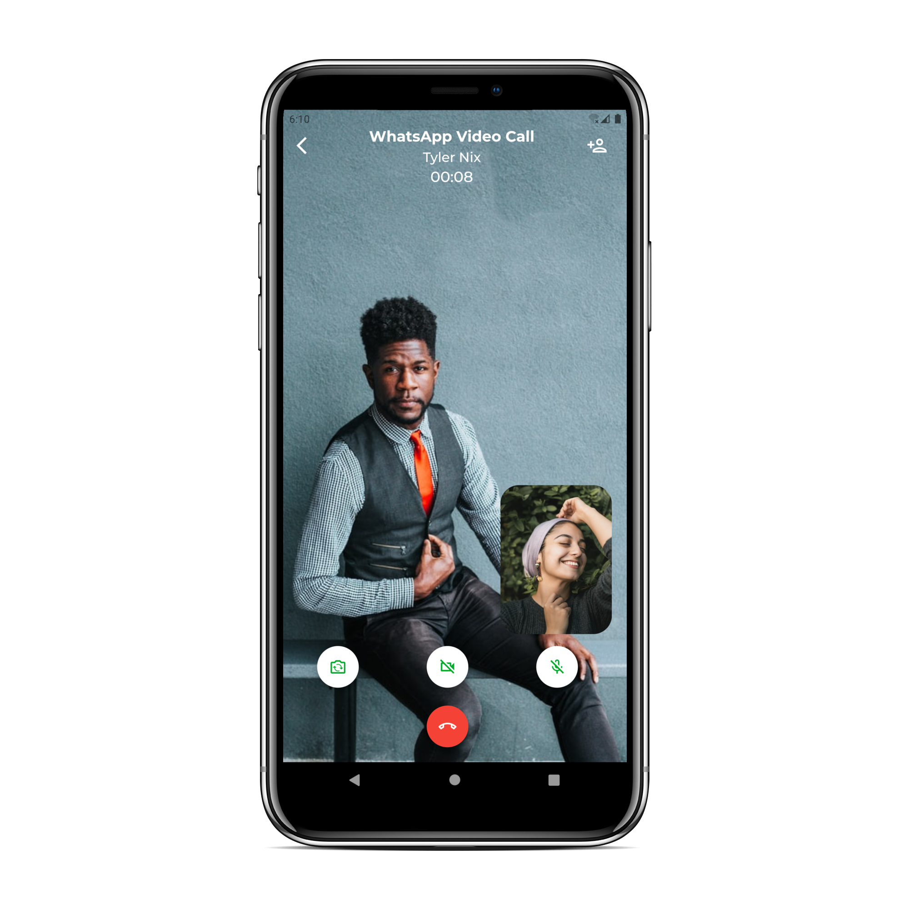
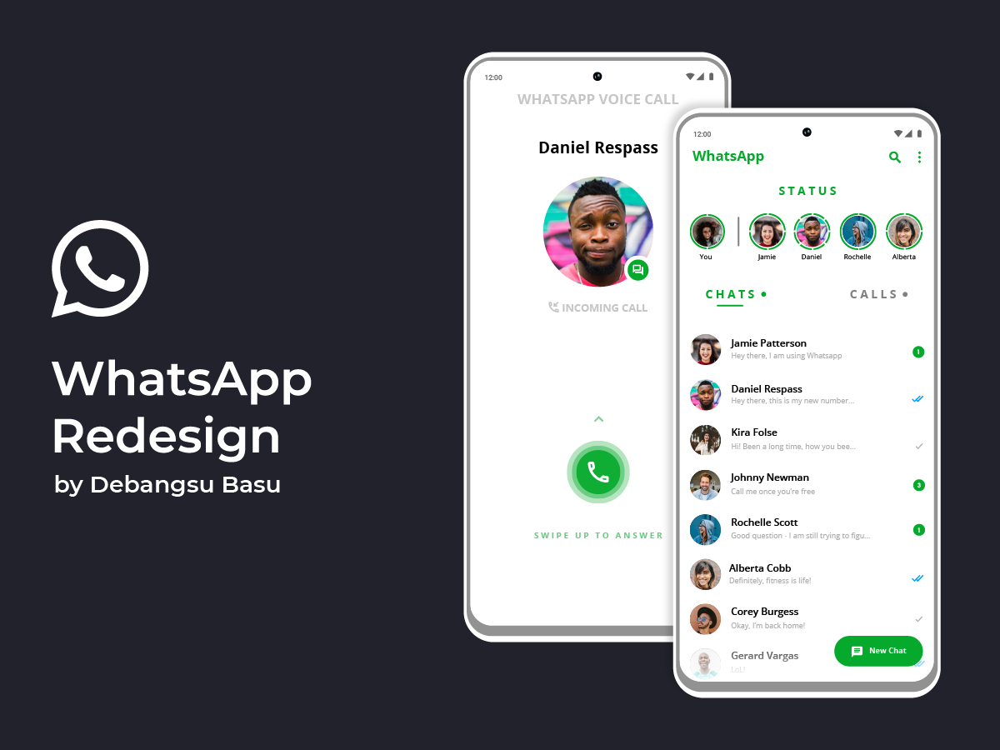

# WhatsApp UI

WhatsApp UI Concept built with Flutter.

## Screenshots
| Chats | Calls |
| :---: | :---: |
|  |  |

| New Chat | Conversation |
| :---: | :---: |
|  |  |

| Incoming Voice Call | Conversation |
| :---: | :---: |
|  |  |

| Video Call (With Controls) | Video Call (Without Controls) |
| :---: | :---: |
|  |  |

| Settings | Profile |
| :---: | :---: |
|  |  |

| WhatsApp Web |
| :---: |
|  |

### Original Design
Original Design on [Uplabs by Debangsu Basu](https://www.uplabs.com/posts/whatsapp-redesign-a-concept).  

 

Made with :heart_eyes: by [Akora-IngDKB](https://github.com/Akora-IngDKB).  
Follow me on [Twitter](https://twitter.com/Akora_IngDKB) and [Instagram](https://www.instagram.com/akora_ingdkb/).     
Please show some :heart: by giving this repo as :star: as I will be updating it with time.  
